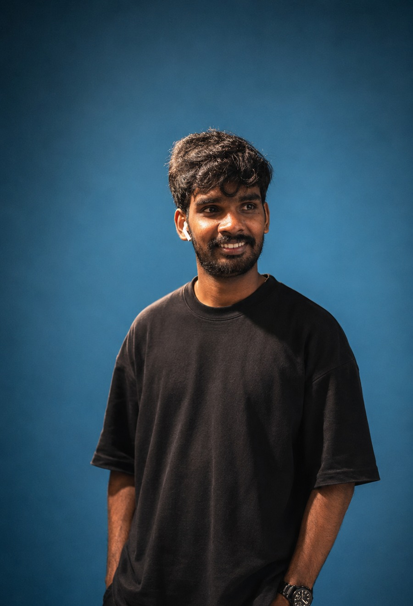

# 🚀 Gokulnath Settu — Portfolio

### Full Stack Developer & Data Analytics Specialist
#### 📍 London, UK &nbsp;|&nbsp; 🎓 MSc Management with Data Analytics — BPP University

---

## 🌟 About Me

I am a highly motivated **Full Stack Developer** with expertise in Python, Java, PHP, and JavaScript, specialising in building scalable web applications and data-driven solutions. With a strong foundation in backend and frontend technologies, I excel in problem-solving, debugging, and optimising performance.

Passionate about leveraging **data analytics** for informed decision-making, I enjoy collaborating with teams to develop innovative software solutions.

---

## 🛠️ Tech Stack

### Languages

### Frontend

### Backend

### Database & Cloud

---

## 💼 Work Experience

| Role | Company | Period |
|------|---------|--------|
| 🔷 Full Stack Developer | XESS Tech Link | Recent |
| 🔷 Full Stack Developer Intern | Ginger Media Group | Prior |
| 🔷 Python Full Stack Developer Intern | Vabyam Technology | Prior |

---

## 🚀 Key Projects

### 📦 E-Commerce Recommendation Engine

Machine learning-powered recommendation system for e-commerce platforms. Increases user engagement through personalised product suggestions using collaborative and content-based filtering.

**Tech:** `Python` `Machine Learning` `Collaborative Filtering` `REST API`

---

### 🫁 AI-Powered Pneumonia Detection System
> **MSc Dissertation Project**

Deep learning model for automated pneumonia detection from chest X-rays using CNN architecture. Achieved high accuracy in medical image classification.

**Tech:** `Python` `TensorFlow` `CNN` `Medical Imaging` `Deep Learning`

---

### 🛒 E-Commerce Website Development
Full-stack e-commerce platform with product management, cart functionality, payment integration, and admin dashboard.

**Tech:** `React.js` `Node.js` `MongoDB` `REST APIs` `Bootstrap`

---

### 📊 Data Visualisation Dashboard
Interactive dashboard for real-time data analysis and visualisation with dynamic charts and filtering capabilities.

**Tech:** `Python` `Django` `Chart.js` `PostgreSQL` `Tailwind CSS`

---

## 🎓 Education

| Degree | Institution | Status |
|--------|-------------|--------|
| 🎓 MSc Management with Data Analytics | BPP University London | In Progress |
| 🎓 BSc Computer Science | Prior Institution | Completed |

---

## 📊 GitHub Stats

---

## 📬 Contact

| Platform | Link |
|----------|------|
| 🌐 Portfolio | [gokulnaths9080.github.io/my-portfolio](https://gokulnaths9080.github.io/my-portfolio/) |
| 💼 LinkedIn | [linkedin.com/in/gokulnath-settu](https://linkedin.com/in/gokulnath-settu) |
| 🐙 GitHub | [github.com/gokulnaths9080](https://github.com/gokulnaths9080) |

---

⭐ **If you like this portfolio, drop a star!** ⭐

*Built with HTML, CSS, JavaScript — Hosted on GitHub Pages*

